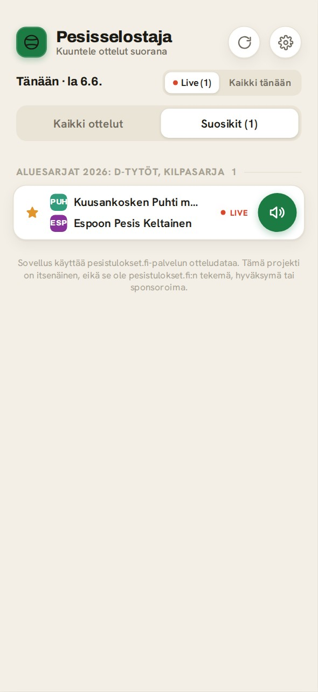
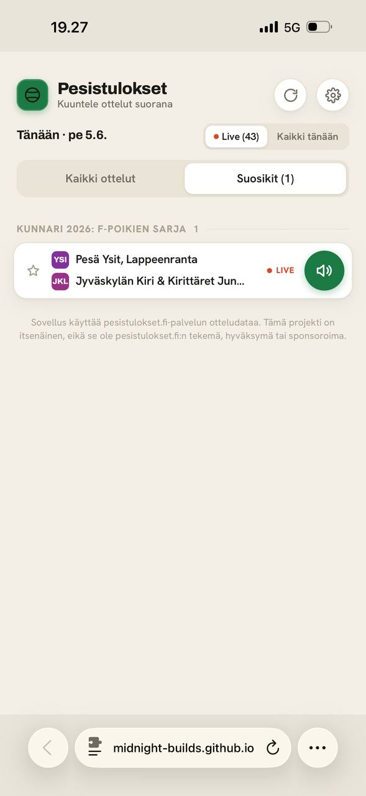

# Pesisselostaja

Web app for following Finnish pesapallo live events with spoken voice announcements.

[Try the web app](https://midnight-builds.github.io/pesisselostaja/)

## Lyhyesti suomeksi

Pesisselostaja on selaimessa toimiva pesäpallon live-seuranta, joka lukee ottelun tärkeimmät tapahtumat ääneen suomeksi. Se on tarkoitettu tilanteisiin, joissa haluat seurata peliä ilman että katsot koko ajan tulospalvelua.
Jaksojen ja palojen seuranta on vielä vajaa ja kertoo välillä vääriä arvoja.

**👉 Avaa sovellus: https://midnight-builds.github.io/pesisselostaja/**

Käyttö:

1. Avaa web-sovellus.
2. Valitse käynnissä oleva ottelu tai syötä ottelun tunnus.
3. Käynnistä seuranta ja salli selaimen puhetoiminto, jos selain pyytää lupaa.
4. Sovellus ilmoittaa ääneen esimerkiksi juoksut, palot, vuoronvaihdot ja jakson tilanteen.

**Vinkki – parempi ääni:** Asetuksista voit valita käytettävän puheäänen. Oletuksena käytetään selaimen omaa puhesyntetisaattoria, mutta ottamalla käyttöön **Edistynyt ääni (Piper)** saat luonnollisemman suomenkielisen neuroverkkoäänen, joka toimii kokonaan selaimessa. Valittavana on Harri-ääni (CC0, lähde rhasspy/Piper) sekä yhteisömalli Asmo (CC BY-NC 4.0, tekijä AsmoKoskinen, epäkaupalliseen käyttöön). Ääni ladataan kerran ja tallennetaan selaimeen, joten se on heti käytössä seuraavilla kerroilla. Jos lataus ei onnistu, sovellus palaa selaimen omaan ääneen. Äänten lähteet ja lisenssit: [CREDITS.md](CREDITS.md).

Sovellus käyttää pesistulokset.fi-palvelun otteludataa. Tämä projekti on itsenäinen, eikä se ole pesistulokset.fi:n tekemä, hyväksymä tai sponsoroima.

## Overview

Pesisselostaja turns live Finnish pesäpallo match updates into spoken Finnish announcements. The public web UI runs in the browser and can speak important match events with the Web Speech API. You can pick which voice to use in the settings, including an optional **advanced neural voice (Piper)** that produces a more natural Finnish voice entirely in the browser.

The repository also contains an advanced Node.js watcher that can send announcements through Home Assistant TTS.

## Screenshots

  
  
  

*Left to right: live match list, favorites tab, voice-active match view.*

## Status

Alpha / public preview.

What works now:

- Browser-based live match following from pesistulokset.fi data.
- Spoken Finnish announcements for important live events.
- Selectable speech voice, including an optional advanced neural voice (Piper) that runs fully in the browser for more natural Finnish.
- Favorites and local settings stored in the browser.
- Advanced Node.js watcher for Home Assistant TTS output.

Known limitations:

- The current web UI is a public preview.
- A redesigned UI is planned.
- The project depends on public pesistulokset.fi endpoints observed from the website frontend.

## Data Source And Affiliation

Pesisselostaja uses live match data from pesistulokset.fi. This project is independent and is not affiliated with, endorsed by, or sponsored by pesistulokset.fi. The data source and API behavior may change without notice.

## Web App Usage

Open the public web app:

~~~text
https://midnight-builds.github.io/pesisselostaja/
~~~

The web app can:

- list live matches for the current day
- open a match by match ID or pesistulokset.fi match URL
- announce key events with browser speech synthesis
- let you choose the speech voice, or enable the advanced neural voice (Piper) from settings for a more natural Finnish voice
- save favorite matches and pronunciation settings in local browser storage

No server account is required. The web app stores settings locally in the browser.

## Advanced Usage: Home Assistant Voice Watcher

The root Node.js app can watch a match from the command line and speak events through Home Assistant TTS.

### Setup

~~~bash
npm install
npm run build
cp .env.example .env
~~~

Edit .env with your Home Assistant URL and long-lived access token.

### Run

Dry run:

~~~bash
npm run dev -- --match-id <match-id> --dry-run
~~~

With Home Assistant TTS:

~~~bash
npm start -- --match-id <match-id>
~~~

Custom poll interval:

~~~bash
npm run dev -- --match-id <match-id> --dry-run --poll-interval 10
~~~

### CLI Options

| Option | Description |
| --- | --- |
| --match-url <url> | pesistulokset.fi match page URL |
| --match-id <id> | Numeric match ID |
| --dry-run | Log speech instead of calling Home Assistant TTS |
| --poll-interval <s> | Poll interval in seconds. Default: 6 |
| --state-file <path> | State file path. Default: .state-<matchId>.json |
| --api-key <key> | Override the observed public API key |

### Environment Variables

| Variable | Description |
| --- | --- |
| HOMEASSISTANT_URL | Home Assistant base URL |
| HOMEASSISTANT_TOKEN | Home Assistant long-lived access token |
| HA_TTS_ENTITY | TTS entity. Default: tts.home_assistant_cloud |
| HA_MEDIA_PLAYER_ENTITY | Media player entity |
| PESISTULOKSET_API_KEY | Optional API key override |
| PESISTULOKSET_API_BASE | Optional API base URL override |

## How It Works

- The browser app and Node.js watcher fetch match metadata and live events from pesistulokset.fi endpoints.
- Event data is converted into short Finnish announcement text.
- The browser app speaks announcements with the Web Speech API.
- The Node.js watcher can send the same style of announcements to Home Assistant TTS.
- Deduplication state prevents the same event from being announced repeatedly.

## Development

Root watcher:

~~~bash
npm ci
npm run lint
npm test
npm run typecheck
npm run build
~~~

Public web app:

~~~bash
cd v2
npm ci
npm run typecheck
npm run build
~~~

## Limitations

- Player name resolution depends on the match metadata. If a player ID in an event doesn't match the roster, the name will show as "?".
- The app depends on public pesistulokset.fi endpoints observed from the website frontend. These endpoints may change, rate-limit, or stop working without notice.
- The events API structure is reverse-engineered from the frontend; it may change.
- Score summaries are only available for completed matches (from the result field).
- Jakso- and palo-tracking is based on heuristics derived from the event stream and may still have edge cases — particularly in youth game variants where the rules differ from standard pesäpallo (e.g. more than three palot per turn).
- Player name resolution depends on match metadata. If a player ID in an event does not match the roster, the app falls back to a less specific announcement.
- Browser speech quality depends on the user's device, browser, and installed Finnish voices. For more consistent quality, enable the advanced neural voice (Piper) in settings; the voice model (roughly 20–60 MB) is downloaded once and cached in the browser.
- Home Assistant usage requires a user-managed Home Assistant instance and a long-lived access token.

## Roadmap

- Redesigned public v2 web UI.
- Clearer separation between the public web app and the Home Assistant voice watcher if both continue to grow.
- Stronger demo/test fixtures for public examples.

## Voices, Sources And Licenses

The optional advanced neural voice uses Piper voice models and a speech stack that
have their own licenses. They are downloaded in the browser at runtime and are not
bundled in this repository:

- **Harri** (`fi_FI-harri`) — CC0 1.0, from rhasspy/Piper (Finnish Single Speaker Speech Dataset).
- **Asmo** (`fi_FI-asmo-medium`) — CC BY-NC 4.0 by AsmoKoskinen; a non-commercial community model, used with attribution.
- Speech stack: Piper (MIT), `@diffusionstudio/piper-wasm` (embeds espeak-ng, GPL-3.0-or-later), onnxruntime-web (MIT).

Full attribution, source links and license notes are in [CREDITS.md](CREDITS.md).
The canonical machine-readable list lives in [`v2/src/piper.ts`](v2/src/piper.ts).

## License

This project's own code is MIT. See [LICENSE](LICENSE). Third-party voices and
libraries keep their own licenses — see [CREDITS.md](CREDITS.md).
